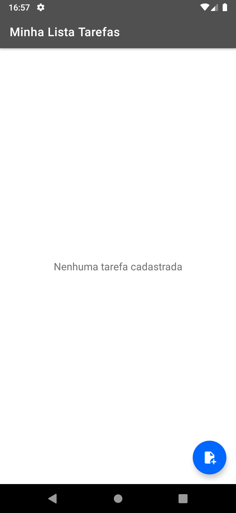

<h1 align="center">APLICATIVO MINHAS TAREFAS</h1>

<p align="center">
  <a href="https://opensource.org/licenses/Apache-2.0"></a>
  <a href="https://android-arsenal.com/api?level=23"></a>
  <br>
  <a href="https://wa.me/+5553984664022"></a>
  <a href="https://www.linkedin.com/in/lorranfranzbastos/"></a>
  <a href="mailto:lorranfranzbastos1@gmail.com"></a>
</p>

<p align="center">  

⭐ Esse é um projeto para demonstrar meu conhecimento técnico no desenvolvimento Android nativo com Kotlin. Mais informações técnicas abaixo.

📐 Aplicativo que faz a criação de tarefas, salvando em uma outra Activity com a funcionalidade de concluir e excluir tarefa!

</p>

</br>

<p float="left" align="center">



</p>

## Download
Faça o download da <a href="apk/app-debug.apk?raw=true">APK diretamente</a>. Você pode ver <a href="https://www.google.com/search?q=como+instalar+um+apk+no+android">aqui</a> como instalar uma APK no seu aparelho android.

## Tecnologias usadas e bibliotecas de código aberto

- Minimum SDK level: 23.
- [Linguagem Kotlin](https://kotlinlang.org/) 

  - Jetpack 
  - Lifecycle: Observe os ciclos de vida do Android e manipule os estados da interface do usuário após as alterações do ciclo de vida.
  - ViewBinding: Liga os componentes do XML no Kotlin através de uma classe que garante segurança de tipo e outras vantagens.
  - Custom Views: View customizadas feitas do zero usando XML.
  - [...]

- Features e melhorias a serem implementadas:
  - Persistência de Dados;
  - Nível de prioridade das tarefas;
  - Histórico de tarefas;
  - SplashScreen;
  - [...]

## Features

### Criando Tarefas


### Concluindo e Excluindo Tarefas


# Licença


```xml

   Copyright [2023] [Lorran Franz Bastos]

   Licensed under the Apache License, Version 2.0 (the "License");
   you may not use this file except in compliance with the License.
   You may obtain a copy of the License at

   http://www.apache.org/licenses/LICENSE-2.0

   Unless required by applicable law or agreed to in writing, software
   distributed under the License is distributed on an "AS IS" BASIS,
   WITHOUT WARRANTIES OR CONDITIONS OF ANY KIND, either express or implied.
   See the License for the specific language governing permissions and
   limitations under the License.

```
